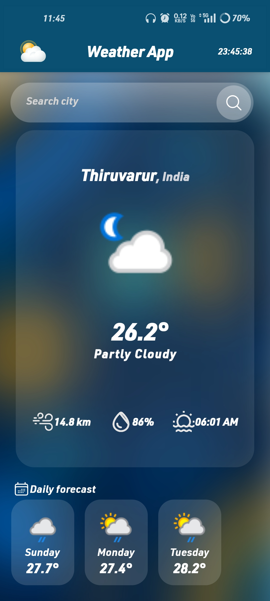
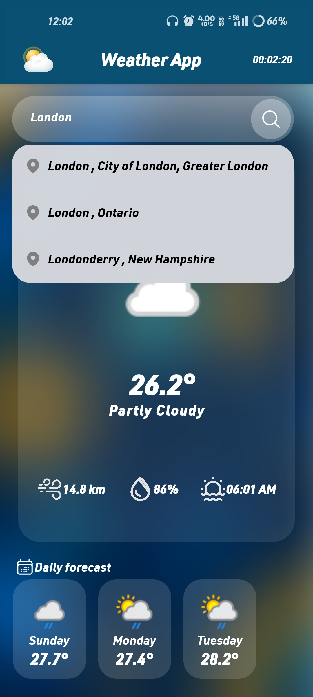

# 🌤️ Weather App

> **Beautiful weather forecasts at your fingertips** ✨

A sleek and modern weather application built with React Native that delivers real-time weather information with stunning visuals and smooth animations.

## 📱 Screenshots

<div align="center">
  
  
</div>

## ⚡ Features

- 🔍 **Smart Search** - Find weather for any city worldwide
- 📊 **7-Day Forecast** - Plan ahead with detailed predictions
- 🌡️ **Real-time Data** - Current temperature, humidity, and wind speed
- 📍 **Location Memory** - Saves your last searched location
- 🎨 **Beautiful UI** - Clean design with smooth animations
- ⏰ **Live Clock** - Real-time display in the header

## 🛠️ Tech Stack

- **React Native** + **Expo** - Cross-platform mobile development
- **NativeWind** - Tailwind CSS for React Native styling
- **Weather API** - Real-time weather data
- **AsyncStorage** - Local data persistence
- **React Navigation** - Smooth app navigation

## 🚀 Quick Start

```bash
# Install dependencies
npm install

# Start the development server
npx expo start

# Choose your platform
# Press 'a' for Android | 'i' for iOS | 'w' for Web
```

## 📝 API Setup

1. Get your free API key from [WeatherAPI.com](https://www.weatherapi.com/)
2. Create a `.env` file in the root directory
3. Add your API key:
   ```
   EXPO_PUBLIC_API_URL=your_api_key_here
   ```

---

**Made with ❤️ using React Native & NativeWind**
